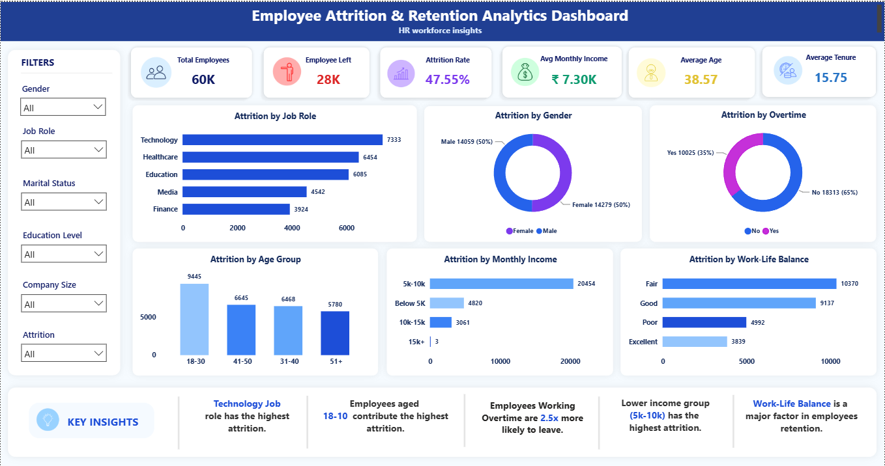

# HR_Atrrition_Retention_Analytics_Dashbord |Using PowerBI

## 📌 Project Overview

This project presents an interactive **HR Analytics Dashboard** developed using **Power BI** to analyze employee attrition and retention trends. The dashboard helps identify key factors affecting employee turnover and provides actionable business insights.

---

## 🎯 Objectives

* Analyze employee attrition patterns.
* Identify high-risk employee groups.
* Evaluate the impact of work-life balance and overtime.
* Understand attrition trends across age groups, departments, and income levels.

---

## 🛠️ Tools & Technologies Used

* Power BI
* DAX (Data Analysis Expressions)
* Power Query
* Data Modeling
* Data Visualization

---

## 📊 Dashboard Features

* KPI Cards

  * Total Employees
  * Employees Left
  * Attrition Rate
  * Average Monthly Income
  * Average Age
  * Average Tenure

* Interactive Visualizations

  * Attrition by Job Role
  * Attrition by Gender
  * Attrition by Age Group
  * Attrition by Monthly Income
  * Attrition by Work-Life Balance
  * Attrition by Overtime

* Interactive Slicers

  * Gender
  * Job Role
  * Age Group
  * Work-Life Balance
  * Marital Status
  * Education Level
  * Company Size
  * Attrition

---

## 📈 Key Insights

* Certain job roles experience higher employee attrition.
* Employees aged 18–30 contribute significantly to overall attrition.
* Overtime has a strong impact on employee turnover.
* Poor work-life balance is associated with increased attrition.
* Lower income groups show higher attrition rates.

---

## 🖼️ Dashboard Preview

---

## 💡 Skills Demonstrated

* Business Intelligence
* HR Analytics
* Data Visualization
* Dashboard Design
* DAX Calculations
* Data Transformation
* Analytical Thinking

---

## 🚀 Project Outcome

This project demonstrates the ability to transform raw HR data into meaningful business insights using Power BI and modern dashboard design principles.
